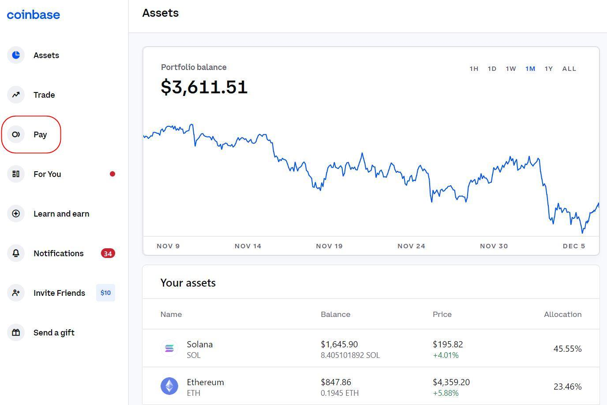

# Overview

## What is Summa?

Summa is a Zero-Knowledge Proof of Reserves tool designed for custodial services that hold cryptocurrency, such as centralized exchanges. It was developed within [PSE](https://appliedzkp.org/) with support from the [Ethereum Foundation](https://ethereum.foundation/).

Summa enables [Custodians](./#custodial) to cryptographically prove that the total [Assets](./#assets) they hold in reserve exceed their [Liabilities](./#liabilities), while keeping sensitive user data private. It enables [Customers](./#customer) to independently verify the solvency of the Custodian with less reliance on trusted third-party auditors.

$$
Assets \geq Liabilities
$$

Specifically, with Summa the Customer can be assured that the Custodian has the funds to cover any and all withdrawals should they choose to remove their funds from the platform.


The term "Proof of Reserves" is used interchangeably with "Proof of Solvency" in these documents. While Proof of Solvency is technically a more accurate way to describe what the tool does, the industry as a whole generally uses Proof of Reserves.&#x20;


## How does it work?

Summa supports all cryptocurrencies on all chains. To run an [Audit](./#audit), the Custodian must first sign a message ([Address Ownership Proof](introduction/protocol-flow.md#id-1.-address-ownership-proof)) with their reserve wallet to prove ownership of the funds in that wallet ([Liabilities Commitment](introduction/protocol-flow.md#id-2.-liabilities-commitment)). The Custodian then generates proofs for each one of their customers ([Inclusion Proof](introduction/protocol-flow.md#id-3.-inclusion-proof)). Using these zero knowledge proofs, each Customer can independently verify that the funds they deposited are being held by the Custodian ([Proof Verification](introduction/protocol-flow.md#id-3.-inclusion-proof)). This all is done in a way that doesn't compromise the privacy of any other customer.&#x20;

For a more in depth look at how Summa works visit the [Protocol Flow](introduction/protocol-flow.md) section of the documentation.

## Common Terms

### Custodian

Custodian refers to a service or solution where a third party, such as centralized crypto exchanges or wallet providers, holds and manages the private keys associated with the user's cryptocurrencies. This is in contrast to non-custodian solutions, such as decentralized crypto exchanges, where the user retains complete control of their private keys and, consequently, the currencies controlled by the private keys.

### Customer

Customer refers to the users of the exchange or custodial service. With Summa, each Customer receives a proof that correlates with their balance on the Custodian's platform.

### Assets

In the context of Proof of Solvency, assets mean the cryptographic assets controlled by the Custodian. Examples of cryptographic assets are ETH, BTC, USDC, and many more. These assets "live" on a blockchain, and everyone can query how many assets are associated with an address via a block explorer such as [Etherscan](https://etherscan.io/). As part of a Proof of Solvency, the Custodian must prove that the assets under their control are greater than their liabilities (user deposits) denominated in the same cryptocurrencies.  &#x20;

### Liabilities

In the context of Proof of Solvency, liabilities indicate the aggregated users' portfolio balances inside the Custodian platform. We call them liabilities as they represent a debt the Custodian owes their users. Similarly to the [assets](./#assets), the liabilities are denominated in cryptocurrencies such as ETH, BTC, USDC, and many more. Differently, accounting for the liabilities (namely, the link between an amount and the user owning it) is not performed on a public blockchain. Instead, the accounting is performed privately by the Custodian via its database.&#x20;

### Audit

An Audit, sometimes referred to as a Round, is a snapshot in time of all the Custodians Assets. Summa aims to decrease hurdles to running frequent audits by lowering the amount of time it takes to form the commitments and price for doing so.

<figure><figcaption></figcaption></figure>

## What makes for a good Proof of Reserves?

Proving statements related to a balance sheet is not something new. It actually dates back to 1494, with the book [Summa de arithmetica](https://en.wikipedia.org/wiki/Summa\_de\_arithmetica), when the double-entry bookkeeping principle was first introduced. The novelty that Summa introduces is the mean of the proof. Rather than being a statement provided by auditors or regulators (or, in 1494, priests) the proof is based on cryptography. Because of that, _users can independently verify its validity without having to rely on trusted intermediaries_.&#x20;

Summa relies solely on [Cryptographic Primitives](cryptographic-primitives/commitments.md) and its codebase is fully [open-source](https://github.com/summa-dev).

As we break away from the traditional compliance infrastructure, the solution can be programmed according to the users' needs. By definition, solvency refers to a specific time snapshot. Proving solvency every semester, or even once per month, might not suffice for today's rapidly changing environment. Summa allows a Custodian to perform a Proof of Solvency round on a per-hour basis (benchmarks [\[1\]](backend/summa-solvency/benchmarks.md) and [\[2\]](backend/summa-aggregation/benchmarks.md))

But what about the Custodian (and its users) data? Naively, someone might think that the only way to achieve such Proof of Solvency is for the Custodian to open their books and databases completely. Instead, Summa uses [Zero Knowledge Proof](cryptographic-primitives/zero-knowledge-proof.md) to prevent that. Sensitive internal data such as the list of users, their balances, or any aggregated data related to users is **not revealed to the public**. &#x20;

Lastly, a common issue in Proof of Solvency solutions relates to the User Experience (UX). To cut off intermediaries, users should be able to verify the Proof independently without trusting any client infrastructure. The most transparent way to achieve this is to let users clone a codebase and perform the verification locally on their machine. Unfortunately, this represents a huge barrier for most users. Summa resolves this tradeoff by creating a [Smart Contract](smart-contract/summa.sol/) that allows users to verify the proof generated by the custodian by simply calling a view function (no gas is required for this action). The code that the Smart Contract is running is public and auditable by everyone, removing the risk of a malicious custodian serving a manipulated verifier function.
