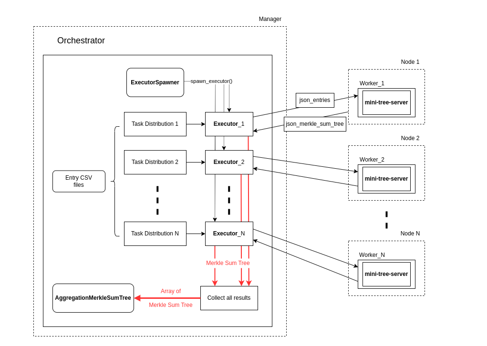

# summa-aggregation

This section describes how to use [`summa-aggregation`](https://github.com/summa-dev/summa-aggregation) to speed up the [Liabilities Commitment ](../../introduction/protocol-flow.md#2.-liabilities-commitment)phase by parallelizing the Merkle Sum Tree generation across different machines.&#x20;

Building a Merkle Sum Tree with [`summa-solvency`](../summa-solvency/) is currently a time-consuming process as it, by default, is an operation performed on a single machine. For example, building a Merkle Sum Tree for 2^28 entries (almost 270M users) [takes around 6200s on a large machine](../summa-solvency/benchmarks.md).&#x20;

A faster Liabilities Commitment Phase allows the Custodian to perform Proof of Solvency rounds more frequently, allowing their users to assess the Solvency every few minutes.


`summa-aggregation` doesn't represent an alternative to `summa-solvency` APIs. Instead, it can be used to replace the construction of the Merkle Sum Tree within the [Liabilities Commitment phase](../summa-solvency/#2.-liabilities-commitment). The whole flow must still be performed using the APIs available in `summa-solvency`


## Summa Aggregation Components

Before diving into the setup process, it's important to understand the key components of Summa Aggregation:

<figure><figcaption><p>Distributed Task Processing with Summa Aggregation Architecture</p></figcaption></figure>

* **Orchestrator, Executor, Worker, and ExecutorSpawner**: These are the core components that interact in the process. The Orchestrator manages tasks, the Executor acts as an intermediary, the Worker processes data, and the ExecutorSpawner initializes and terminates Executors.&#x20;
* **AggregationMerkleSumTree Component**: A specialized component for efficiently constructing large Merkle sum trees. Each Worker is tasked to build a portion of the AggregationMerkleSumTree.  The workes operate in parallel and, eventually, pass the computed portions to the Orchestrator that will aggregate them in the final AggregationMerkleSumTree.

## Run Summa Aggregation

The following steps can be performed via a working example in [aggregation-flow](https://github.com/summa-dev/summa-aggregation/blob/main/examples/aggregation\_flow.rs).

### 1. Setup Node

Summa Aggregation is fully optimized for containerized environments, offering a streamlined setup for a distributed environment through Docker Swarm. Please refer to [Getting Started with swarm mode](https://docs.docker.com/engine/swarm/swarm-tutorial) for instructions on setting up a Docker Swarm network.

Whether using Docker or Docker Swarm, the Custodian must first ensure that the nodes intended to function as Workers are properly prepared. These nodes are a critical part of `summa-aggregation`, as their URLs are utilized by the `ExecutorSpawner`.

The Custodian is required to supply an array of these node URLs as input for the `worker_node_url` parameter within the `ExecutorSpawner`. An example of the `worker_node_url` array is as follows:

```rust
let worker_node_urls = vec!["10.0.0.1:4000".to_string(), "10.0.0.2:4000".to_string()];
```

### 2. Generic Parameters

[Similar to `summa-solvency`](../summa-solvency/#1.-generic-parameters), it is essential to determine these key parameters for Summa Aggregation: `N_CURRENCIES`, `N_BYTES`, and `LEVELS`.&#x20;

### 3. CSV files

When using `summa-aggregation`, the Custodian has to provide multiple `.csv` files, as opposed to a single file containing all users' data, as in [`summa-solvency`](../summa-solvency/#2.-liabilities-commitment) .

In particular, each `.csv` file should contain the entries to be processed in a single Merkle Sum Tree by a Worker. Each file should be parsed similarly to what was described in [`summa-solvency`](../summa-solvency/#2.-liabilities-commitment). Furthermore, it is required that each `.csv` file maps to a Merkle Sum Tree of the same dimension. It should be noted that the number of .csv files does not need to match the number of workers. For example, the orchestrator can function well with four .csv files and three workers, where the first worker processes two .csv files.

```rust
let entry_csvs = [
            "./src/orchestrator/csv/entry_16_1.csv".to_string(),
            "./src/orchestrator/csv/entry_16_2.csv".to_string(),
]
```

### 4. Generate Aggregation Merkle Sum Tree

The `Orchestrator` requires a spawner that implements the `ExecutorSpawner` trait. We provide `CloudSpawner` which is optimized for use with Docker Swarm. To run in Docker Swarm mode, CloudSpawner needs service\_info that includes the path to the docker-compose.yml file and the service name. An instance of CloudSpawner can be created as follows:

```rust
let spawner = CloudSpawner::new(Some("docker-compose.yml", "mini-tree"), worker_node_urls, 4000);
```

Note that the last argument, `4000`, is the default port for the `worker_node_urls`. If the URLs provided do not include port numbers, port `4000` will be used as the default.

Finally, the Orchestrator can generate an AggregationMerkleSumTree, which can be used as input for a Round instance. The code for obtaining a Round instance looks like this:

```rust
let orchestrator = Orchestrator::<N_CURRENCIES, N_BYTES>::new(Box::new(spawner), entry_csvs);
let aggregation_merkle_sum_tree = orchestrator.create_aggregation_mst(worker_node_urls.len()).await.unwrap();

// Assume the declaration code for timestamp, params_path, and signer is located here

let round = Round::<LEVELS, N_CURRENCIES, N_BYTES>::new(
        &signer,
        Box::new(aggregation_merkle_sum_tree),
        params_path,
        timestamp,
    ).unwrap();
```

From this point forward, the remaining steps to achieve the entire flow are similar to [those in `summa-solvency`](../summa-solvency/#2.-liabilities-commitment)
