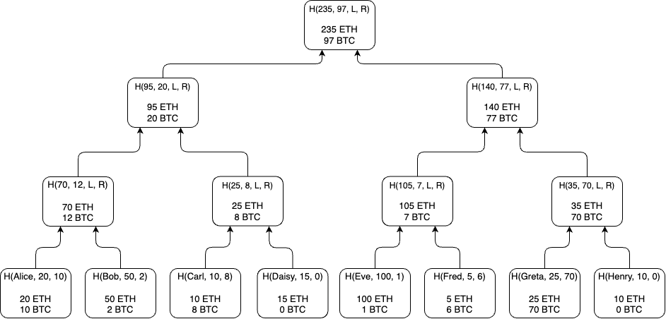

# Merkle Sum Tree

A popular [commitment scheme](commitments.md), useful when dealing with larger data structures, is a [Merkle Tree](https://en.wikipedia.org/wiki/Merkle\_tree). In a Merkle Tree, each data entry is hashed and inserted as a _tree leaf_. Each leaf is hashed with the sibling one to produce a middle node. This process is repeated for each tree level until it reaches a single node at the top, called the _Merkle Root_, which is a commitment to the entire data set.

Merkle Trees are especially useful when you want to prove the existence (typically known as "inclusion proofs") of a specific piece of entry data within a large set without revealing the entire set in a time-efficient manner.

Summa uses a modified version of a Merkle Tree as a cryptographic commitment scheme, which is a **Merkle Sum Tree**. In the context of Summa, the Merkle Sum Tree data entries are the Custodian liabilities. At the same time, the _Root_ represents a commitment to the state of the liabilities.

<figure><figcaption></figcaption></figure>

The core properties of the [`MerkleSumTree`](https://github.com/summa-dev/summa-solvency/blob/master/zk\_prover/src/merkle\_sum\_tree/mst.rs#L21) used by Summa are:

* Each entry of a Merkle Sum Tree is a pair of a username and the associated balance.
* Each Leaf Node contains a hash and a balance. A leaf node exists for each entry.
  * The hash is equal to `H(username, balance)`.&#x20;
  * The balance of a leaf node is equal to the balance of the associated entry
* Each Middle Node contains a hash and a balance.&#x20;
  * The hash is equal to `H(LeftChild.balance + RightChild.balance, LeftChild.hash, RightChild.hash)`
  * The balance is equal to the sum of the balances of the two child nodes
* The Root Node is the last Middle Node of the tree. Analogously to a traditional Merkle Tree, the hash of the root represents a blinding and hiding commitment to the state of the entries. In addition to a traditional Merkle Tree, the Merkle Root contains a balance that represents the sum of the balances of the tree entries.

While the example uses a balance in only a single cryptocurrency (ETH), Summa's Merkle Sum Tree supports multiple cryptocurrencies.&#x20;

<figure><figcaption></figcaption></figure>

Note that Summa uses the "broken" version of Maxwell's Merkle Sum Tree ([2022/043](https://eprint.iacr.org/2022/043) paragraph 4.1). Nevertheless, the usage of this tree, in conjunction with zero knowledge proof, allows us to [overcome the vulnerability described in the paper](https://github.com/summa-dev/summa-solvency/issues/166).


Aggregating multiple currencies in the same tree can slow down the building process as the hasher input increases linearly with the number of currencies, as this process can not be easily parallelized. In contrast, parallelization can be easily achieved by building one tree per currency. The latter comes with a worse user experience since users will need to verify one proof for each currency.

