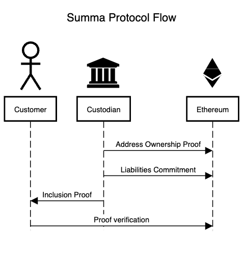

# Protocol Flow

<figure><figcaption>
A full Proof of Solvency flow with Summa
</figcaption></figure>

### 1. Address Ownership Proof

First, the Custodian must prove ownership of specific addresses and, therefore, of the assets controlled by those addresses. To do that, the Custodian groups its wallets and signs a particular message (it's up to the Custodian to choose the message) with each of them.&#x20;

The data containing the blockchain name, addresses, signatures, and messages are submitted to [Summa Smart Contract](../smart-contract/summa.sol/).&#x20;


While the Summa Smart Contract can only be deployed on Ethereum or EVM-compatible blockchains, there's no limit to the cryptocurrencies that the Proof of Solvency protocol can support. Any non-EVM-compatible currency, such as BTC or SOL is supported by Summa.


The proof of address ownership is a batch of signatures. The contract stores the proof optimistically. This means that no cryptographic verification is performed on submission. The signatures must be subject to off-chain verification starting from the data publicly stored on the contract. Everyone can perform this verification.

This phase doesn't need to be run before every Proof of Solvency round. Instead, it can be run once and updated only if the Custodian moves their assets to a new address.

### 2. Liabilities Commitment

To kick off a Proof of Solvency round, the Custodian must provide a timestamped snapshot of its liabilities.&#x20;

This is done by aggregating all the users' data and feeding them to build a [Merkle Sum Tree](../cryptographic-primitives/merkle-sum-tree.md). The root node of the Tree contains a hash and the sum of the users' balances (liabilities sum) denominated in different cryptocurrencies.

The root node represents a [commitment](../cryptographic-primitives/commitments.md) to the state of the [liabilities](../#liabilities) of the Custodian at a specific timestamp.&#x20;

The commitment is [submitted](../smart-contract/summa.sol/solidity-api.md#submitcommitment) to [Summa Smart Contract](../smart-contract/summa.sol/), which stores it optimistically.&#x20;

When receiving the proof, the contract doesn't automatically verify that the assets controlled by the addresses claimed in Step 1 are greater than the liabilities sum published as part of the commitment. This verification must be performed off-chain by:

1. Fetching the addresses of the Custodian from the Smart Contract (as claimed in step 1)&#x20;
2. Fetch the [assets](../#assets) controlled by these at the timestamp. These can be done using any block explorer and querying for the balance at the next available block at the timestamp
3. For each cryptocurrency, summing the assets together&#x20;
4. For each cryptocurrency, verify that the asset sum is greater than the liabilities sum

Everyone can perform this verification.&#x20;

### 3. Inclusion Proof

Even if all the previous steps are verified correctly, there's still a risk that the Custodian has maliciously manipulated the liabilities. For example, excluding "whales" from the Merkle Sum Tree, understating user balances, or adding negative balances would result in fake liabilities sums. [Here](https://hackmd.io/j85xBCYZRjWVI0eeXWudwA#Proof-of-Liabilities-PoL), you can find other common attack vectors on the liabilities side.

The only way to ensure this is not the case is to ask individual users to verify their correct accounting in the liabilities. Practically speaking, the Custodian, when queried by users, provides them with a zero-knowledge[ proof of their inclusion](../circuits/merkle-sum-tree-inclusion.md) in the Merkle Sum Tree.&#x20;

### 4. Proof Verification

The proof is verified through a [view function on the Smart Contract](../smart-contract/summa.sol/solidity-api.md#verifyinclusionproof). It involves verifying that:

* The cryptographic proof, associated with a specific timestamp, is valid&#x20;
* The root commitment, public input of the proof, matches the one published by the Custodian in step 2 associated with that specific timestamp
* The leaf hash, public input of the proof, is equal to the result of hashing their username and balances. The balances must match the actual balance of the user at the timestamp.

If verified by the user, the proof guarantees that they have been accounted for correctly (with the right balance!) in the Merkle Sum Tree and that that tree branch was built correctly, namely without any balance overflow during the summation.

The rule is simple: if enough users request a Proof of Inclusion and they can all verify it correctly, it becomes increasingly likely that the Liabilities Commitment is legit. A more thorough analysis of how the number of users performing the verification influences the probability that the Custodian is cheating is performed in the paper [Generalized Proof of Liabilities - Ji and Chalkias - Section 5](https://eprint.iacr.org/2021/1350.pdf).
